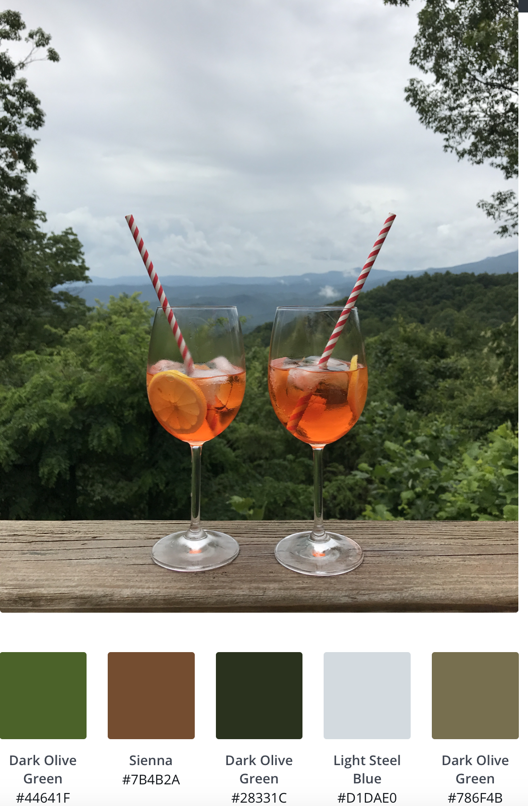

With all this time inside, I decided to base my map style on a photo of one of my favorite drinks in one of my favorite places, the mountains of North Carolina. I thought the color choices that the palate pulled out of this photo were interesting. 

I was curious to see how this would work out in my map because the color choice was relatively similar to map choices, but also a lot of green. It took me a while to figure out what each of the different levels of edits were that I was making. So initially, I was really zoomed out on the map so I was not seeing a lot of the changes I was making. At first, I thought this is coming together and looks good. 

Then I zoomed into a more to the city level and realized the color combinations I was choosing, particularly the text fill and outline combinations were very severe and did not look good together. Once I realized that, I was able to make changes to make things easier on the eye. Overall, I'm not sure I would stick with this color combination, but I enjoyed playing around with different options. 

Screen Shot 2020-03-24 at 10.04.56 AM.png

I also found it interesting learning about the background behind the different layers of options. When working in ArcGIS, it feels like you just pick your feature layer and a color for road for example and that is it. Although this is in a different tool, it was nice to gain a better understanding of how the development of the base of a map works rather than just the surface level change I've made in the past. 
